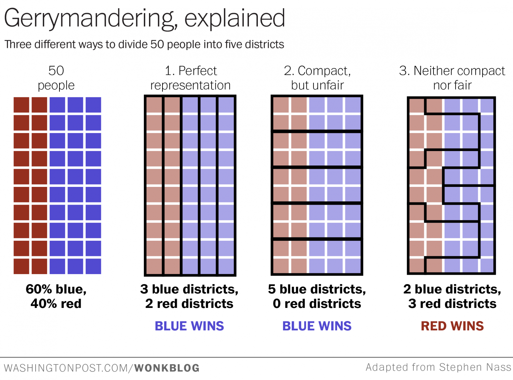

Capstone-Gerrymandering
=======================
Gerrymandering is the process of producing electoral districts such that the anticipated votes from these districts would disproportionately favor those who create them. A wonderful visualization of this process was produced by [The Washington Post](https://www.washingtonpost.com/news/wonk/wp/2015/03/01/this-is-the-best-explanation-of-gerrymandering-you-will-ever-see/?utm_term=.a0d638d12c92) as an adaptation of work by [Stephen Nass](https://www.reddit.com/r/woahdude/comments/2xgqss/this_is_how_gerrymandering_works/):

The goal of this project is to quantify how representative current and proposed districts are  by comparing their expected . For this study, I have used election data from Wisconsin for the 2016 election cycle. Three principal types of districts will be presented:
1. Districts as established by the state of Wisconsin
2. Districts generated by a simple enforcement of [shape compactness](https://en.wikipedia.org/wiki/Compactness_measure_of_a_shape) and nearly equal voting-age populations.
3. Same as 2, but seeking to ensure that as-generated districts are competitive. More specifically, that no district would be expected to be won by more than a certain margin of victory on average by chance.

Districts during 2016 election cycle
-----------------
### Congressional districts
These districts were established as described here.

### State assembly districts

### State senate districts
