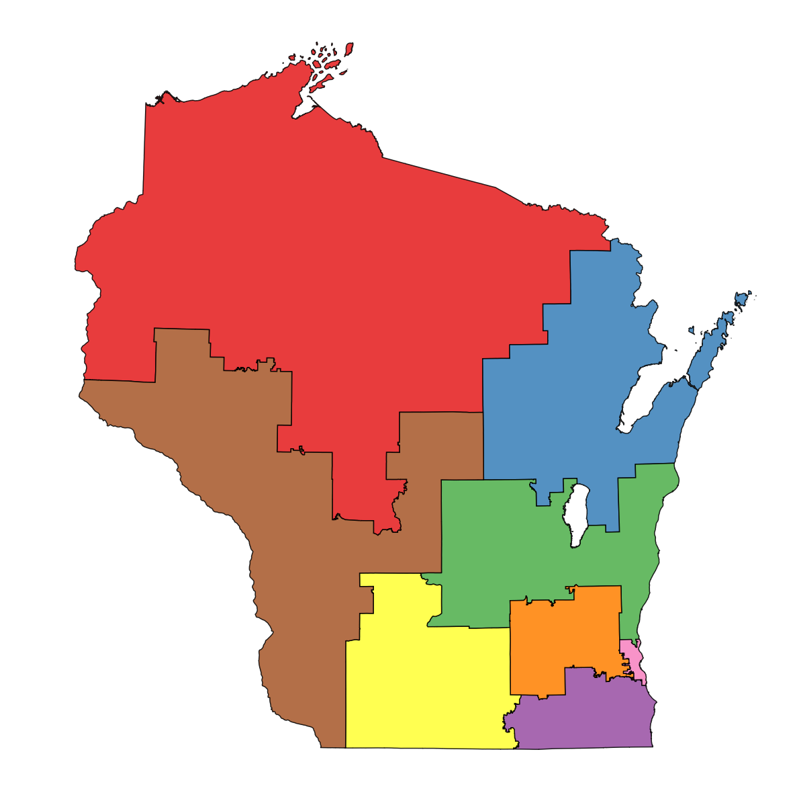

Ecclesia
=======================
The goal of this project is to quantify how representative current and proposed districts are  by comparing their simulated outcomes to what we would expect if we were to have a representative set of districts. For this study, I have used election data from Wisconsin for the 2016 election cycle. Two principal types of districts will be presented:
1. Districts as established by the state of Wisconsin
2. Districts generated by a modified version of [K means](https://elki-project.github.io/tutorial/same-size_k_means) using voting-age populations as the determiner of 'size' for each district.

Introduction to gerrymandering
------------------------------
Gerrymandering is the process of producing electoral districts such that the anticipated votes from these districts would disproportionately favor those who create them. A wonderful visualization of this process was produced by [The Washington Post](https://www.washingtonpost.com/news/wonk/wp/2015/03/01/this-is-the-best-explanation-of-gerrymandering-you-will-ever-see/?utm_term=.a0d638d12c92) as an adaptation of work by [Stephen Nass](https://www.reddit.com/r/woahdude/comments/2xgqss/this_is_how_gerrymandering_works/):

Current districts
-----------------
### Congressional districts - 2016 election cycle
These districts were established as described [here](http://docs.legis.wisconsin.gov/statutes/statutes/3.pdf).

